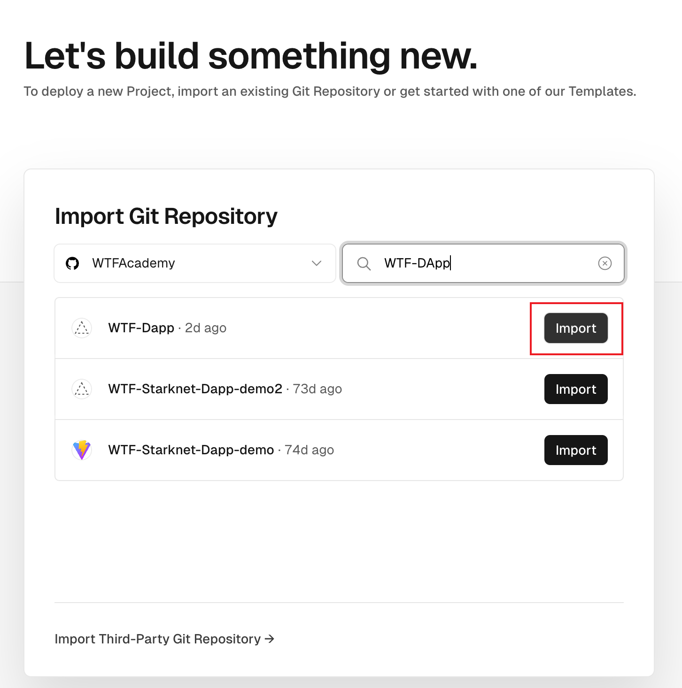

这一讲将会介绍如何把我们的应用部署到服务器上，完成前端部分功能从开发到最终上线。

## 简介

这里会简单介绍一下 Next.js 以及前端部署的一些基本概念。如果你对前端已经很熟悉，可以跳过这部分。

[Next.js](https://nextjs.org/) 是一个前端框架，它可以帮助我们快速搭建 React 应用。我们基于 React 和 Next.js 开发完成我们的应用之后，需要将其构建并部署到服务器上，让用户可以访问我们的应用。

通过在项目中执行 `npm run build`（对应就是 `package.json` 中定义的 `next build`），它会将我们的应用构建为 JavaScript、CSS 等文件，这些文件或是在浏览器中运行的文件，浏览器本质上只支持执行 JavaScript，并不会原生支持 React，所以需要我们将其编译为浏览器可以执行的文件。又或者是在服务器的 NodeJS 环境中执行的 JavaScript，这部分让我们有能力处理一些服务端的逻辑，我们前面的课程中并未涉及到这部分，但是在后续的课程中，类似签名验证这样的逻辑就依赖于服务端的实现了。

执行成功可以看到类似下面这样的效果：

构建完成后你可以继续执行 `npm run start`，这样你的应用就成功在你本地部署了。对应的，如果你需要部署在你自己的服务器，那么流程是相同的，你需要在你的服务器中安装依赖、构建并通过 `npm run start` 或者 `next start` 启动你的应用。

当然，如果你使用的是 [umi](https://umijs.org/) 等其它前端框架，也是类似的逻辑，通常都需要构建和启动服务。如果构建产物是只有浏览器环境运行的静态资源，那么你只需要类似 Nginx 或者 express 这样的框架来部署一个 Web 容器存放即可，或者也可以使用 [Github Pages](https://pages.github.com/) 来部署。

## 基于 Vercel 部署

这一部分我们引导你基于 [Vercel](https://vercel.com/) 部署你的应用。 Next.js 就是 Vercel 官方在做支持的框架，它提供了一个非常简单的部署方式，你只需要将你的代码上传到 Github 或者 Gitlab 等代码托管平台，然后在 Vercel 上选择你的仓库，它会自动帮你构建并部署你的应用。

首先，请将你之前的代码推送到你自己的 Github 上，或者你也可以 Fork 本仓库 [https://github.com/WTFAcademy/WTF-Dapp](https://github.com/WTFAcademy/WTF-Dapp)，我们在 [demo](../demo/) 文件夹中提供了完整的代码。

登录 Vercel 后在其控制台中创建一个新的项目：

接下来选择并导入你的 Github 项目，这个过程中可能需要你授权 Vercel 访问你的 Github 仓库：

你需要选择 Root Directory 为 Next.js 项目的根目录，然后点击 Deploy：

接下来一切都会自动完成：

最后本教程的 Demo 就呈现在 [https://wtf-dapp.vercel.app/web3](https://wtf-dapp.vercel.app/web3) 中了。

## 自定义域名

Vercel 会提供一个默认的域名，但是通常我们需要一个自定义的域名，这样更加专业。你可以在 Vercel 的控制台中找到你的项目，然后在 Domains 中添加你的域名：

添加后你需要按照提示在你的域名服务商中添加一条 CNAME 记录，这样你的域名就可以指向 Vercel 的服务器了。
