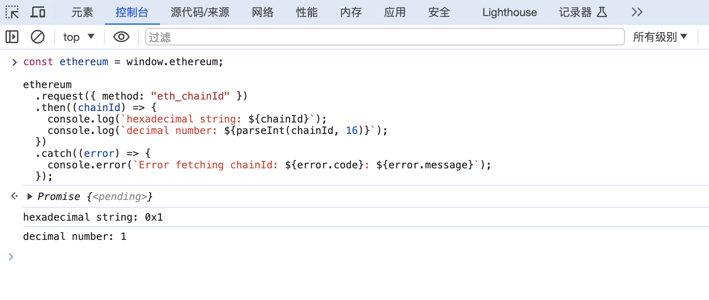

我们在第三讲[连接钱包](./03_ConnectWallet/readme.md)中介绍了如何连接钱包，但是没有深入讲解连接钱包的原理。EIP1193 和 EIP6963 是两个重要的协议，它们定义了 DApp 连接钱包的标准。EIP1193 是最早期的标准，但是有一些缺陷，EIP6963 则是对 EIP1193 的改进，解决了那些缺陷。

本文将介绍这两个协议的基本概念，帮助你理解链接钱包的逻辑。

## EIP1193

EIP1193 的规范地址在[https://eips.ethereum.org/EIPS/eip-1193](https://eips.ethereum.org/EIPS/eip-1193)，它定义了在浏览器中如何通过 JavaScript 与钱包进行交互，有了这个规范钱包才能按照他提供相关接口，DApp 才能按照它调用钱包提供的接口。

这个定义很简单，其实就是约定了浏览器运行时的全局对象 `window` 上的 `ethereum` 对象的格式，定义了一些方法和事件。

对于 DApp 来说，它需要检查 `window.ethereum` 是否存在，如果存在，那么它就可以调用 `window.ethereum` 上的方法来和钱包进行交互。就同调用浏览器其他 API 类似，比如 `window.localStorage`。

下面是一个简单的例子可以获取链的 ID：

```javascript
const ethereum = window.ethereum;

ethereum
  .request({ method: "eth_chainId" })
  .then((chainId) => {
    console.log(`hexadecimal string: ${chainId}`);
    console.log(`decimal number: ${parseInt(chainId, 16)}`);
  })
  .catch((error) => {
    console.error(`Error fetching chainId: ${error.code}: ${error.message}`);
  });
```

你可以尝试在浏览器的控制台运行查看效果：



对于更多方法，也就对应修改 `request` 调用时的参数即可，支持的方法可以参考 [JSON-RPC API](https://ethereum.org/developers/docs/apis/json-rpc)。当然，对于一些钱包可能不支持的方法，你需要做好异常处理。也有一些钱包特有的一些方法或者一些已经约定俗成的方法，你需要查看钱包的文档。

通常来说，在 DApp 中你应该使用类似 `web3.js`、`ethers`、`viem` 这样的 SDK 来和钱包进行交互，这些 SDK 会帮你封装好一些方法，让你更方便的和钱包进行交互。

以上就是 EIP1193 的基本概念，但是 EIP1193 有一个主要的缺陷。就是 `window.ethereum` 对象只有一个，所以当用户安装了多个钱包时，用户只能选择一个钱包来使用。这样会导致钱包之间会争抢 `window.ethereum` 对象，一方面损害了用户体验，另外也不利于钱包之间的良性竞争。

在之前很长一段时间，针对这个问题钱包的做法一般是会注入自己独特的对象，比如 TokenPocket 会注入 `window.tokenPocket`。但是这样的做法并不是标准的，也不是一个好的解决方案。另外，这样的做法也会导致 DApp 需要适配很多钱包，增加了 DApp 的开发成本。

所以就有了 EIP6963，接下来我们会介绍 EIP6963。

## EIP6963

EIP6963 的规范地址在[https://eips.ethereum.org/EIPS/eip-6963](https://eips.ethereum.org/EIPS/eip-6963)。

EIP6963 不再通过 `window.ethereum` 对象来和钱包进行交互，而是通过发送往 `window` 发送事件的方式来和钱包进行交互。这样就解决了 EIP1193 的问题，多个钱包可以和 DApp 进行交互，而不会争抢 `window.ethereum` 对象。

另外钱包也可以通过发送事件的方式主动告知 DApp 它的存在，这样 DApp 就可以知道用户安装了哪些钱包，然后根据用户的选择来和钱包进行交互。

技术上来讲其实就是通过浏览器的 `window.addEventListener` 来监听消息，通过 `window.dispatchEvent` 来发送消息。所有的消息的 `type` 都有 `eip6963:` 前缀，具体的消息内容定义可以参考规范文档。

对于开发者来说，和 EIP1193 一样，你使用一些社区的库即可，这样可以免去对细节的关注。比如你如果使用 wagmi，那么通过配置 [multiInjectedProviderDiscovery](https://wagmi.sh/core/api/createConfig#multiinjectedproviderdiscovery) 即可接入 EIP6963。

如果你使用了 [Ant Design Web3](https://web3.ant.design/zh-CN/components/wagmi#eip6963)，通过配置 `WagmiWeb3ConfigProvider` 的 `eip6963` 即可在 DApp 中使用 EIP6963。它的连接钱包的弹窗会自动添加检测到的钱包。

下面是我们基于之前的课程例子的修改示例：

```diff
export default function Web3() {
  return (
    <WagmiWeb3ConfigProvider
      config={config}
      wallets={[MetaMask()]}
+     eip6963={{
+       autoAddInjectedWallets: true,
+     }}
    >
      <Address format address="0xEcd0D12E21805803f70de03B72B1C162dB0898d9" />
      <NFTCard
        address="0xEcd0D12E21805803f70de03B72B1C162dB0898d9"
        tokenId={641}
      />
      <Connector>
        <ConnectButton />
      </Connector>
      <CallTest />
    </WagmiWeb3ConfigProvider>
  );
}
```

其中配置了 `eip6963` 使得使用通过 EIP6963 协议连接钱包，避免了多个钱包之间可能出现的冲突。另外添加了 `autoAddInjectedWallets` 配置使得自动添加检测到的钱包到 Ant Design Web3 的 UI 中，提升用户体验，让用户可以自由选择他已经安装的钱包。

## 总结

不管是 EIP1193 还是 EIP6963，它们都是通过浏览器的 JavaScript API 来和钱包进行交互的。它要求钱包可以向 DApp 的运行时注入对象或者发送事件，比如通过 Chrome 浏览器插件，或者你在钱包内置的浏览器中访问 DApp。

但是对于有的场景，用户没有安装插件，或者是在移动端浏览器访问 DApp，无法使用插件。又或者用户需要用其他手机安装的钱包客户端来连接 DApp。不管是 EIP1193 还是 EIP6963，都无法满足这些场景。所以，我们还需要其他的方式来连接钱包，比如 WalletConnect。我们会在下一讲介绍如何使用 WalletConnect 来连接钱包。
