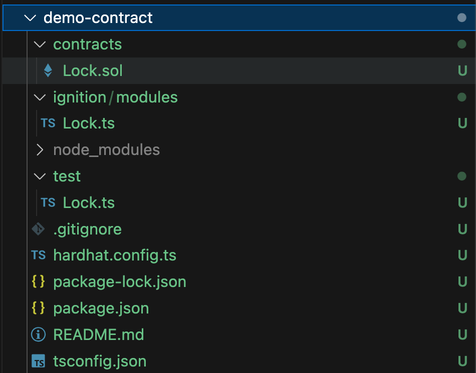
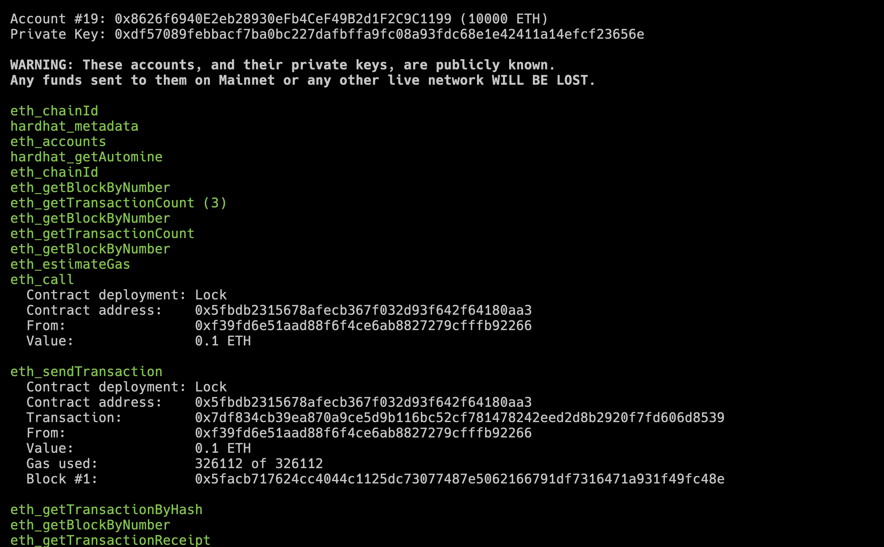

在前面的课程中，我们基于 Remix 尝试了通过 CloudIDE 进行合约开发。在本地开发环境中，我们可以使用更多的工具来提高开发效率，比如使用 Git 来进行版本管理。这一讲将会引导大家在本地开发和调试合约，以及编写单元测试来验证智能合约的逻辑。

---

## 初始化项目

以太坊的生态有着丰富的开发工具，比如 [Hardhat](https://hardhat.org/)、[Foundry](https://getfoundry.sh/) 等。这里我们将使用 Hardhat 来搭建本地开发环境，将本课程之前开发的合约迁移到本地环境中。

我们参考 [hardhat 的快速开始文档](https://hardhat.org/hardhat-runner/docs/getting-started) 执行如下命令快速初始化一个项目：

```bash
mkdir demo-contract
cd demo-contract
npx hardhat@2.22.3 init
```

和[第一章](../01_QuickStart/readme.md)初始化 NextJS 项目类似，`npx` 是安装完成 NodeJS 后自带的命令，如上命令会自动下载 [hardhat npm 包](https://www.npmjs.com/package/hardhat) 并执行 `init` 命令。使用 `2.22.3` 版本是因为它是本课程编写时的最新版本，这样可以保证你的环境和本课程一致。当然你也可以去掉版本号使用最新版。

我们选择第三项，使用 Typescript + viem，和我们之前课程的技术栈保持一致。


创建完成后你会得到如下的目录结构：



每一部分文件的作用如下：

- `contracts`：存放 Solidity 合约代码。
- `test`：存放测试代码。
- `ignition`：合约部署脚本，比如定义合约部署的参数等。
- `hardhat.config.ts`：Hardhat 配置文件。

## 本地开发和调试

初始化项目时会自动安装依赖，如果没有安装，可以执行 `npm i` 重试。安装完成后执行下面命令即可编译合约：

```bash
npx hardhat compile
```

执行下面命令可以执行测试样例：

```bash
npx hardhat test
```

然后执行下面命令在本地启动一个用于调试的测试网络：

```bash
npx hardhat node
```

启动之后你会看到会默认给你分配一些地址用于调试，接下来你可以将合约部署到本地节点上：

```bash
npx hardhat ignition deploy ./ignition/modules/Lock.ts --network localhost
```

部署成功后你可以在本地的测试网络日志中看到相关交易信息：



至此，我们本地的环境就搭建好了，接下来我们试试把之前写的 NFT 放到本地环境并调试。

## 迁移合约

TODO
