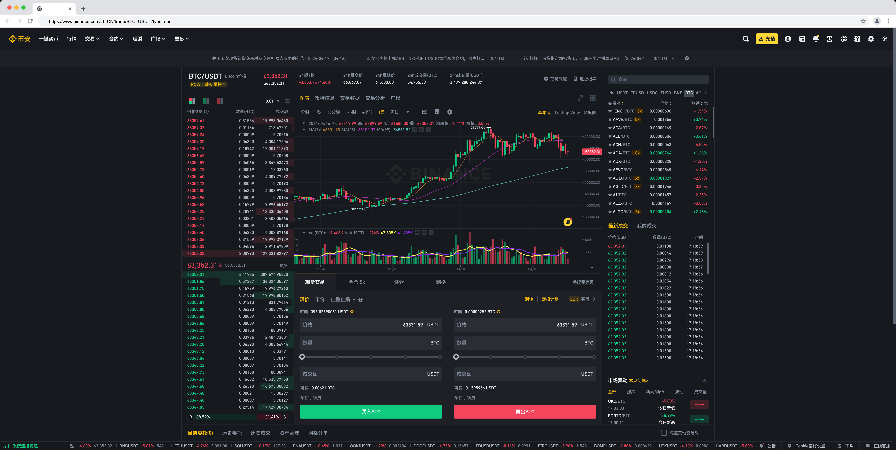

这一讲我们会介绍什么是去中心化交易所（DEX），以及它的一些关键特质和相关概念，让你可以从产品逻辑上理解 DEX，为后面的开发实战做好概念上的认识。

---

## 什么是去中心化交易所（DEX）？

[Uniswap](https://app.uniswap.org/) 和 [OpenSea](https://opensea.io/) 就是典型的两个去中心化交易所。前者主要用于交易代币, 后者主要用于交易 NFT。当然，这并不是绝对的，比如 Uniswap 现在也可以用于交易 NFT。

为什么说它们是去中心化交易所呢？这是如何判断的呢？

其中最简单的判断方法就是看交易是否是通过智能合约处理，而不是通过中心化的服务器处理。如果是通过智能合约处理，那么这个交易所就是去中心化交易所。

当你通过 Uniswap 来交易代币时，网站会请求你连接钱包，然后通过钱包来签名交易，最后通过智能合约来完成交易。这个过程中，Uniswap 并没有自己的服务器来处理交易，而是通过智能合约来处理交易。即便是 Uniswap 的网站服务器挂了，或者某一天 Uniswap 的所有员工突然穿越到古埃及捡贝壳去了，你依然可以通过调用自动合约来完成交易。

如上图所示，当你在 Uniswap 上面发起交易时，本质上就是调用合约，Uniswap 的网站仅仅是一个用户界面，用来帮助你调用合约。所以理论上来说你也可以搭建一个自己的网站，然后调用 Uniswap 的合约来完成交易。

和去中心化相对应的便是类似[币安](https://www.binance.com/zh-CN)、[OKX](https://www.okx.com/zh-hans) 这样的中心化交易所。

上图是币安交易页面的截图，你通过邮箱注册、实名认证、绑定手机、设置密码等一系列操作，然后通过币安的服务器来完成交易。这个过程中，币安的服务器是中心化的，如果币安的服务器挂了，那么你就无法完成交易。

当然，目前来看中心化的交易所似乎功能更强大，速度和效率也更快，那为什么还要去中心化呢？除了避免服务器挂掉的问题，去中心化交易所的优势是什么呢？

很多人可能想到的第一点就是安全性，资产在中心化的交易所中更安全。当然，这是一个重要的优势，但不是唯一的优势。接下来就让我们来继续看看为什么我们需要去中心化交易所。

## 为什么需要去中心化交易所

## 实现一个去中心化交易所需要考虑的问题

## 名词解释

### 自动化做市商（AMM）

### LP（流动性资金池）

### 滑点
